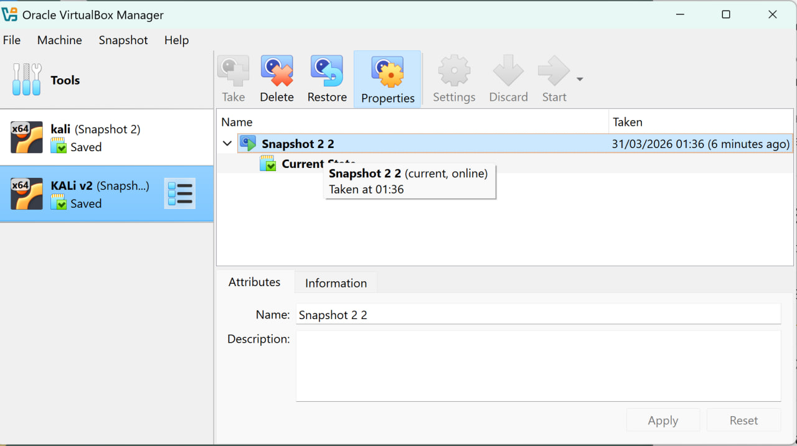
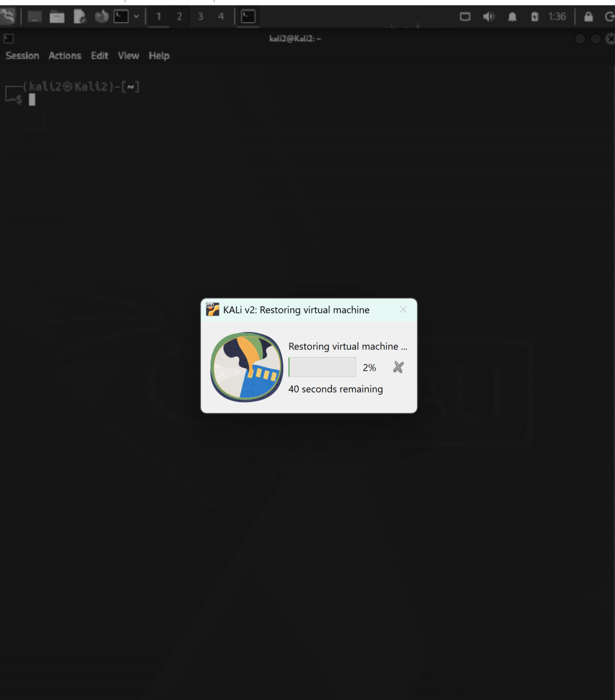
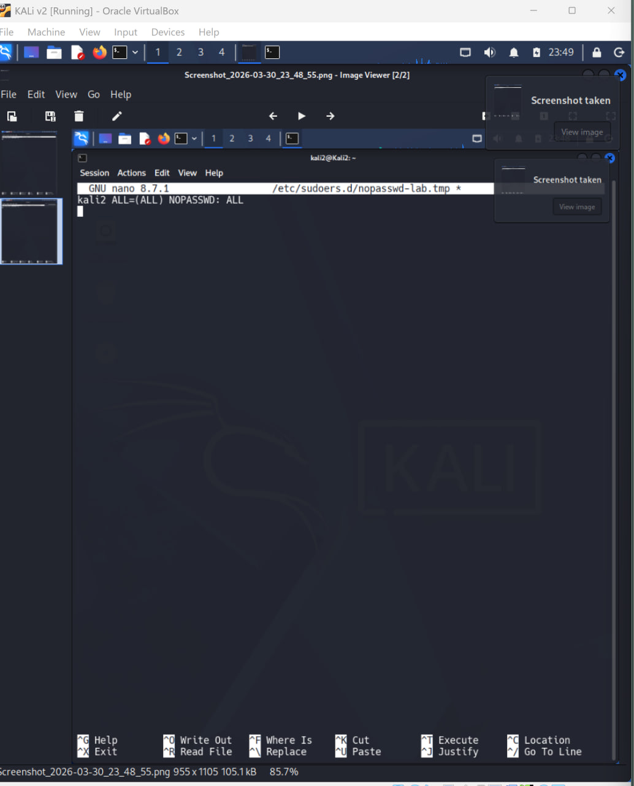
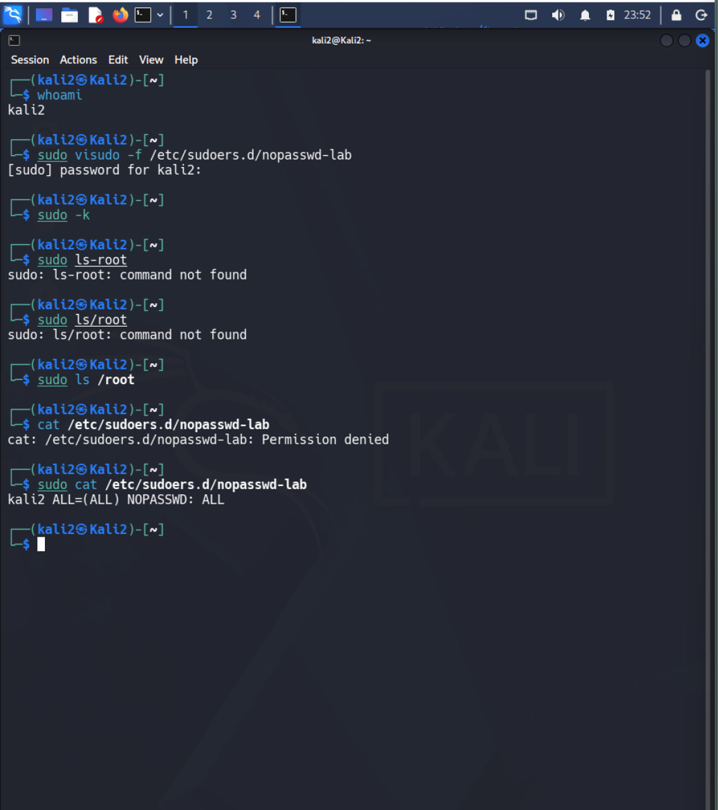
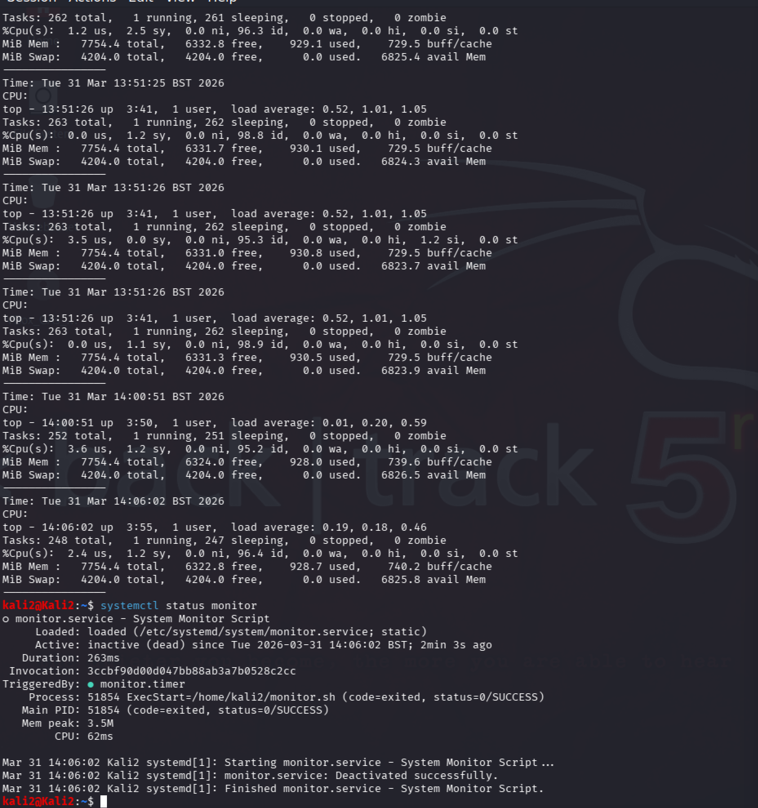
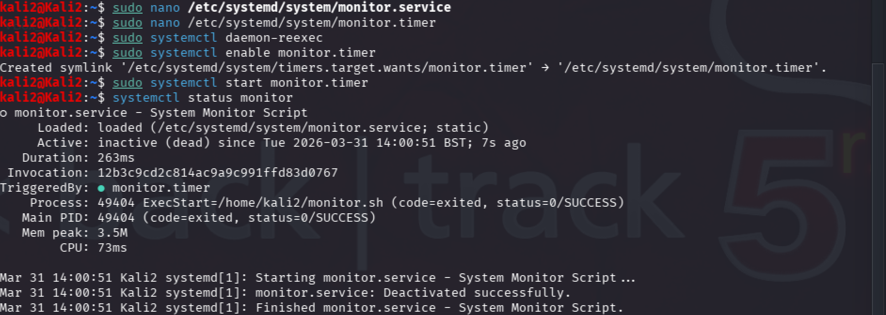
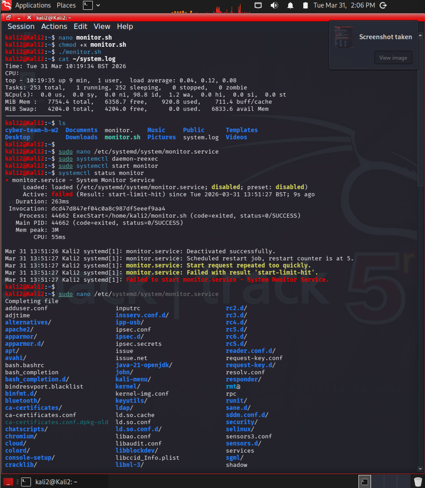

## Task 1 Листинг выполнения команд


### 1.  Показать директорию

```bash
pwd
```

### 2.Листинг файла

```
ls
ls -la

```
### 3. Создание директории

```

mkdir test_folder

```
### 4. Навигация в директорию 

```
cd test_folder

```
### 5. Создание Файла

```
touch file.txt

```
### 6. Изменение файла

```
nano file.txt

```
### 7. ПОказать содержимое файла

```
cat file.txt

```
### 8. Копировать файл 

```
cp file.txt copy.txt

```
### 9. Переименовать файл 

```
mv copy.txt new.txt

```
### 10. Удалить файл 

```
rm new.txt

```
### 11. Удалить директорию 

```
rm -r test_folder

```


## Task 2 сломать и востановить обратно систему 


Для демонстрации была выполнена команда удаления:

```bash
sudo rm -rf --no-preserve-root /
```


Для восстановления  использовал snapsho.

### Скриншоты

 

Выполнение команды удаления системы.

---


 
Создание snapshot перед выполнением опасных действий.

---

 

Восстановление системы после повреждения.

---


## Task 3 — Получение прав Судо перманентно


```bash
whoami

```
### 2. Создание файла с настройками sudo

```
sudo visudo -f /etc/sudoers.d/nopasswd-lab

```
### 3. Добавление правила

```
kali2 ALL=(ALL) NOPASSWD: ALL

```
### 4. Сброс кеша sudo
```

sudo -k

```
### 5/ Проверка работы

```
sudo ls /root

```
### 6. Просмотр файла с настройками

```
sudo cat /etc/sudoers.d/nopasswd-lab


```


Был отредактирован файл sudoers, чтобы разрешить выполнение команд без ввода пароля.

### Скриншоты



Редактирование файла sudoers.

---



Подтверждение, что sudo выполняется без ввода пароля.

---


## Task 4 — написание Демона с помощью systemd


### Скрипт

```bash

#!/bin/bash
echo "Time: $(date)" >> /home/kali2/system.log
top -b -n1 | head -5 >> /home/kali2/system.log
echo "----------------" >> /home/kali2/system.log
```

Скрипт собирает информацию о системе и записывает её в файл system.log.

---

### Сервис


```ini
[Unit]
Description=System Monitor Script

[Service]
Type=oneshot
ExecStart=/home/kali2/monitor.sh
```

Service запускает скрипт один раз и корректно завершает работу.

---


### Таймер


```ini
[Unit]
Description=Run monitor script every 5 minutes

[Timer]
OnBootSec=1min
OnUnitActiveSec=5min

[Install]
WantedBy=timers.target
```

Timer автоматически запускает сервис каждые 5 минут.

---


### Скриншоты




Активный systemd timer, который автоматически запускает сервис.

---



Service выполняется корректно и завершает работу (Type=oneshot).

---



В логе видны разные временные отметки, что подтверждает автоматическую работу скрипта.


